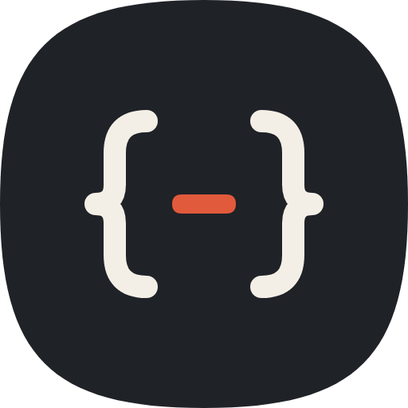
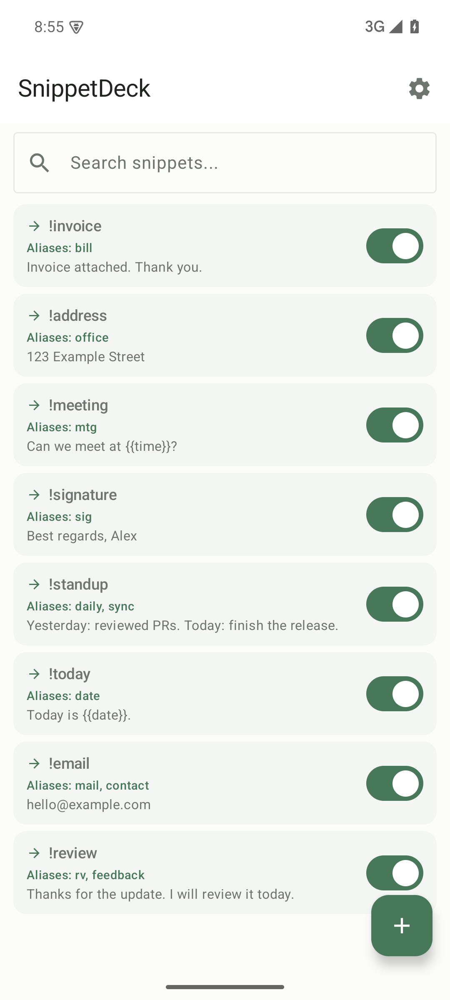
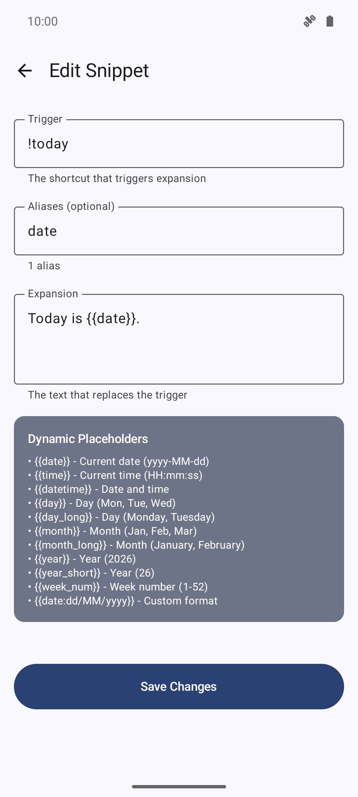
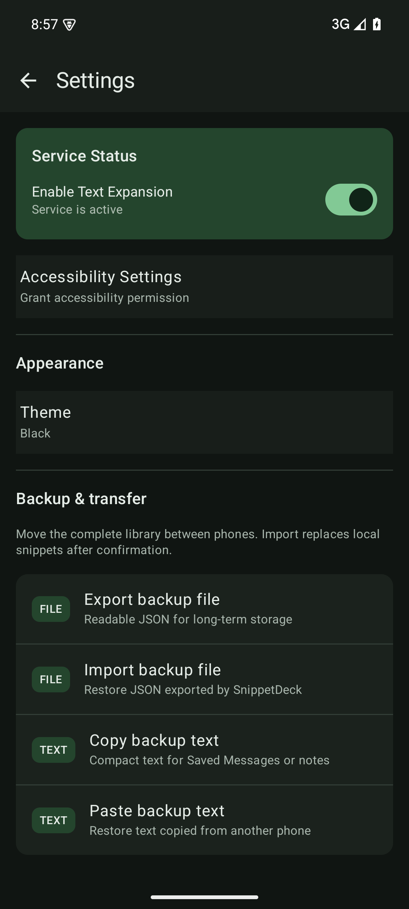

<p align="center">
  
</p>

<h1 align="center">SnippetDeck</h1>

<p align="center">
  A fast, local-first text expander for Android.
</p>

<p align="center">
  <a href="https://github.com/Krablante/snippet-deck/actions/workflows/ci.yml"></a>
  <a href="https://github.com/Krablante/snippet-deck/releases/latest"></a>
  <a href="LICENSE"></a>
  
</p>

Type a trigger such as `!review`, press Space, and SnippetDeck replaces it immediately before the cursor. Text after the cursor stays in place, and the app never submits the target field.

## See it in action

<table>
  <tr>
    <td width="33%" align="center">
      
      <br><strong>Build your library</strong>
      <br><sub>Keep triggers, aliases, and expansions easy to scan.</sub>
    </td>
    <td width="33%" align="center">
      
      <br><strong>Create flexible snippets</strong>
      <br><sub>Add plain aliases and dynamic values such as <code>{{date}}</code>.</sub>
    </td>
    <td width="33%" align="center">
      
      <br><strong>Stay in control</strong>
      <br><sub>Manage the service, appearance, and portable backups.</sub>
    </td>
  </tr>
</table>

```text
Create a snippet  →  type !today + Space  →  SnippetDeck inserts the expansion
```

## Highlights

- Cursor-aware expansion that preserves surrounding text.
- One primary trigger and any number of aliases per snippet.
- Immediate Backspace undo after an expansion.
- Dynamic `!help` generated from enabled snippets.
- Date and time placeholders such as `{{date}}`, `{{time}}`, `{{year_short}}`, and `{{week_num}}`.
- Enabled and disabled snippets, search, and light, dark, or system themes.
- Portable JSON files and compact text backups for moving a library between devices.
- Fully local snippet storage with no account, backend, analytics, advertising, or data sync.
- Quiet GitHub release checks and verified in-app APK updates.

## Install

SnippetDeck requires Android 13 or newer.

1. Download the APK from the [latest GitHub release](https://github.com/Krablante/snippet-deck/releases/latest).
2. Install the APK. Android may ask you to allow installation from your browser or file manager.
3. If Android blocks the accessibility service for a sideloaded app, open **App info → menu → Allow restricted settings**.
4. Open SnippetDeck and enable its accessibility service.

## Updates

On a normal app launch, SnippetDeck makes one quiet request to the public GitHub Releases API when Android reports a validated internet connection. Nothing is shown when the installed version is current, the device is offline, or the automatic check fails.

You can also open **Settings → About → Check for updates** at any time. Downloading and installation always require an explicit tap. Before Android opens its package installer, SnippetDeck verifies:

- The exact versioned APK asset and GitHub-provided SHA-256 digest.
- The application ID, version name, and increasing version code.
- The official SnippetDeck signing certificate.

There is no background polling or automatic installation. Contextual `PROCESS_TEXT` launches never trigger an update check.

## Use

1. Create a snippet with a trigger and expansion.
2. Optionally add aliases separated by commas, semicolons, or new lines. Aliases are used exactly as entered and do not require `!`.
3. Type the trigger in an editable field and press Space.
4. Press Backspace immediately after an expansion to restore the trigger where supported by the target app.

Typing `!help` followed by Space produces a compact list of enabled snippets.

## Backup and transfer

Open **Settings → Backup & transfer**:

- **Export backup file** creates readable, versioned JSON suitable for long-term storage.
- **Import backup file** previews the snippet count before replacing the local library.
- **Copy backup text** creates a compact `SNIPPETDECK_BACKUP_V2` payload for a note or message to yourself.
- **Paste backup text** accepts that payload or a supported JSON backup.

Both formats preserve triggers, aliases, expansions, enabled state, and timestamps. Import is transactional and replaces the complete library so deletions transfer correctly. Legacy raw-array, v1.0 JSON, and text V1 backups remain importable.

> [!CAUTION]
> Backups may contain sensitive text. Store and share them accordingly.

## Privacy and security

SnippetDeck uses Android's accessibility API only to detect triggers and replace text in editable fields. Observed field content is not stored or transmitted.

- Snippets and settings stay in the app's local Room database.
- Snippet content leaves the app only when you explicitly export or copy a backup.
- Network access is limited to GitHub release metadata and an APK download you explicitly approve. Snippets, observed text, settings, and backups are never included in those requests.
- There is no account system, analytics, advertising, remote-control component, background updater, or data-sync service.
- Official updates must keep the same Android signing identity so they can be installed over an existing version without clearing local data.

## Build from source

Requirements:

- Android Studio or Android SDK 36
- JDK 17 or newer
- An Android 13+ device or emulator

Clone the repository, configure your Android SDK in an ignored `local.properties`, and run:

```bash
./gradlew testDebugUnitTest lintDebug assembleDebug --no-daemon --max-workers=2
```

The debug APK is written under `app/build/outputs/apk/debug/` and uses a separate application ID, so it can be installed alongside an official release.

See [Contributing](CONTRIBUTING.md) for development expectations and [Operations](docs/OPERATIONS.md) for signed builds and releases.

## Architecture

```text
Compose editor ──► Room database ──► AccessibilityService ──► editable field
       │
       ├─────────► file/text backup codec
       └─────────► GitHub release updater ──► Android installer
```

See [Architecture](docs/ARCHITECTURE.md) for component boundaries, data formats, and compatibility contracts.

## Lineage and license

SnippetDeck is based on [Expander](https://github.com/rrajath/expander) by Rajath Radhakrishnan and contributors. It is distributed under the [MIT License](LICENSE).
