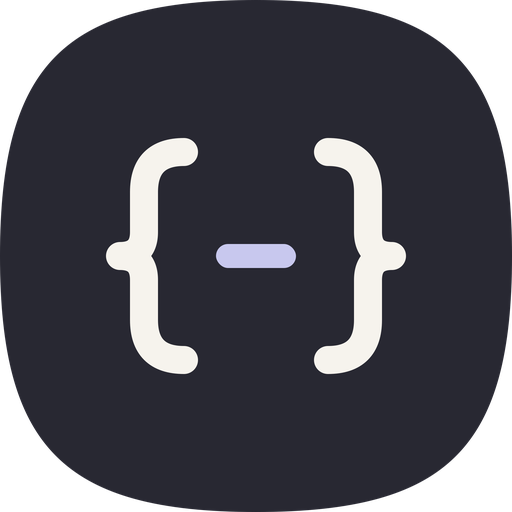
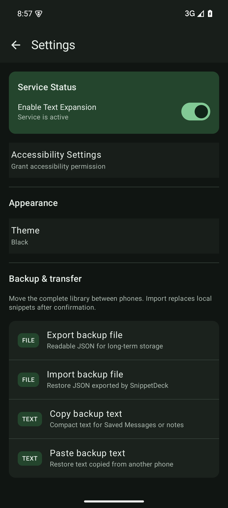

<p align="center">
  
</p>

<h1 align="center">SnippetDeck</h1>

<p align="center">
  A fast, local-first text expander for Android and desktop.
</p>

<p align="center">
  <a href="https://github.com/Krablante/snippet-deck/actions/workflows/ci.yml"></a>
  <a href="https://github.com/Krablante/snippet-deck/actions/workflows/desktop.yml"></a>
  <a href="https://github.com/Krablante/snippet-deck/releases/latest"></a>
  <a href="LICENSE"></a>
  
</p>

Type a trigger such as `!review`, press Space, and SnippetDeck replaces it immediately before the cursor. Text after the cursor stays in place, and the app never submits the target field.

## See it in action

<table>
  <tr>
    <td width="33%" align="center">
      
      <br><strong>White · Build your library</strong>
      <br><sub>Keep triggers, aliases, and expansions easy to scan.</sub>
    </td>
    <td width="33%" align="center">
      
      <br><strong>Sepia · Create flexible snippets</strong>
      <br><sub>Add plain aliases and dynamic values such as <code>{{date}}</code>.</sub>
    </td>
    <td width="33%" align="center">
      
      <br><strong>Black · Stay in control</strong>
      <br><sub>Manage the service, appearance, and portable backups.</sub>
    </td>
  </tr>
</table>

```text
Create a snippet  →  type !today + Space  →  SnippetDeck inserts the expansion
```

## Highlights

- Cursor-aware expansion that preserves surrounding text.
- One primary trigger and any number of aliases per snippet.
- Immediate Backspace undo after an expansion.
- Dynamic `!help` generated from enabled snippets.
- Date and time placeholders such as `{{date}}`, `{{time}}`, `{{year_short}}`, and `{{week_num}}`.
- A compact, searchable snippet library with enabled state and White, Black, or Sepia themes.
- Portable JSON files and compact text backups for moving a library between devices.
- Local snippet storage with optional sync through your own Google Drive account; no SnippetDeck server, analytics, or advertising.
- Quiet GitHub release checks and verified in-app APK updates.
- A desktop editor and background text expansion for Windows, macOS, and Linux X11.

## Install

The [SnippetDeck website](https://krablante.github.io/snippet-deck/) introduces the app and hosts its [privacy policy](https://krablante.github.io/snippet-deck/privacy.html). Installers are published on GitHub Releases.

### Android

SnippetDeck requires Android 13 or newer.

1. Download the APK from the [latest GitHub release](https://github.com/Krablante/snippet-deck/releases/latest).
2. Install the APK. Android may ask you to allow installation from your browser or file manager.
3. If Android blocks the accessibility service for a sideloaded app, open **App info → menu → Allow restricted settings**.
4. Open SnippetDeck and enable its accessibility service.

### Desktop

Download the Windows, macOS (Apple Silicon or Intel), or Linux X11 installer (`.msi`, `.dmg`, or `.deb`) alongside the Android APK from the [latest GitHub release](https://github.com/Krablante/snippet-deck/releases/latest). Development builds are also available from the [Desktop builds workflow](https://github.com/Krablante/snippet-deck/actions/workflows/desktop.yml). The macOS builds are currently unsigned and have not yet been tested on a Mac; Gatekeeper may require an explicit **Open Anyway** decision. Windows and macOS compatibility should be verified on real machines before relying on them for everyday use.

Launch the app and leave it running to expand text. Closing the editor keeps the background agent available in the tray. **More options → Start at login** enables automatic launch; **Text expansion** pauses it. On macOS, grant the app Accessibility permission when prompted, then reopen it. On Linux Wayland, the library editor remains usable, but automatic text expansion is not supported. The X11 build does not require root privileges.

## Updates

On a normal Android app launch, SnippetDeck makes one quiet request to the public GitHub Releases API when Android reports a validated internet connection. Nothing is shown when the installed version is current, the device is offline, or the automatic check fails. Desktop installers currently have no in-app updater.

You can also open **Settings → About → Check for updates** at any time. Downloading and installation always require an explicit tap. Before Android opens its package installer, SnippetDeck verifies:

- The exact versioned APK asset and GitHub-provided SHA-256 digest.
- The application ID, version name, and increasing version code.
- The official SnippetDeck signing certificate.

There is no background polling or automatic installation. Contextual `PROCESS_TEXT` launches never trigger an update check.

## Use

1. Create a snippet with a trigger and expansion.
2. Optionally add aliases separated by commas, semicolons, or new lines. Aliases are used exactly as entered and do not require `!`.
3. Type the trigger in an editable field and press Space.
4. Press Backspace immediately after an expansion to restore the trigger where supported by the target app.

Typing `!help` followed by Space produces a compact list of enabled snippets.

On desktop, click **+** to add a snippet, or open one to edit it. Triggers and aliases expand when followed by Space; the Space is consumed, as on Android. A Backspace immediately after expansion restores the trigger. The desktop editor closes completely when dismissed; you can reopen it from the tray or the app launcher. Behavior can vary between target applications, so verify it in the editors you use most. Single-line snippets use native input; multiline snippets paste as text so line breaks cannot submit a target field.

## Appearance

SnippetDeck includes three stable palettes that do not inherit wallpaper colors:

- **White** — a clean neutral canvas with restrained green actions.
- **Black** — Textory's deep low-light palette with high-contrast text.
- **Sepia Paper** — a warm book-like canvas with a brown accent.

Existing Light and Dark preferences migrate to White and Black. A legacy System preference resolves once to White or Black using the device mode active during migration.

## Backup and transfer

On Android, open **Settings → Backup & transfer**:

- **Export backup file** creates readable, versioned JSON suitable for long-term storage.
- **Import backup file** previews the snippet count before replacing the local library.
- **Copy backup text** creates a compact `SNIPPETDECK_BACKUP_V2` payload for a note or message to yourself.
- **Paste backup text** accepts that payload or a supported JSON backup.

Both formats preserve triggers, aliases, expansions, enabled state, and timestamps. Import is transactional and replaces the complete library so deletions transfer correctly. Legacy raw-array, v1.0 JSON, and text V1 backups remain importable.

On desktop, open **More options → Export backup…** to save the same JSON format, or **Import backup…** to read Android JSON and compact text backups. Import shows the snippet count and replaces the complete local library only after confirmation. The desktop app stores its working copy in the operating system's application-data directory. Backup files remain useful for recovery even when cloud sync is enabled.

> [!CAUTION]
> Backups may contain sensitive text. Store and share them accordingly.

## Google Drive sync

Sync is optional. On Android, open **Settings → Google Drive sync → Connect Google Drive**. On desktop, click **Connect** in the library. Use the same Google account on each device. SnippetDeck requests access only to its own hidden app-data folder in Drive; it cannot read your other Drive files. No separate SnippetDeck account or server is needed.

Each device keeps its working library locally. SnippetDeck syncs when you open the app and after you save changes, or when you tap **Sync now**. It does not poll in the background while closed. You can edit offline; the next sync sends those changes. Independent edits merge, including deletions. If the same trigger was changed on two devices before they exchanged changes, neither edit is silently overwritten: choose **Use this device's library** or **Use other device's library** after reviewing or exporting backups. The latter option applies when there is one other connected device.

Sync and backups are separate. Disconnecting stops sync on that device and preserves its local library and history; it does not erase the existing data in your Google Drive. Your snippet content is not end-to-end encrypted: Google can access the files stored in your Drive. See the [privacy policy](PRIVACY.md).

## Privacy and security

On Android, SnippetDeck uses the accessibility API to detect triggers and replace text in editable fields. The desktop agent keeps only a short in-memory buffer of recently typed characters to detect a trigger. Observed field content is not stored or transmitted.

- On Android, snippets and settings stay in the local Room database. Desktop keeps its library and settings in local app data.
- When you connect Google Drive, both platforms send snippets, deletions, and sync metadata to the app's folder in your account. Without that choice, snippet content stays local except when you explicitly export or copy it.
- Android checks GitHub for release metadata and downloads an APK only after approval. Neither platform sends observed typing to Google or GitHub.
- Desktop multiline expansion briefly uses the system clipboard and attempts to restore its previous content. Clipboard managers may retain copied text; avoid storing secrets in multiline snippets.
- There is no SnippetDeck account system, server, analytics, advertising, remote control, or background polling.
- Official updates must keep the same Android signing identity so they can be installed over an existing version without clearing local data.

## Build from source

Android requirements:

- Android Studio or Android SDK 36
- JDK 17 or newer
- An Android 13+ device or emulator

Clone the repository, configure your Android SDK in an ignored `local.properties`, and run:

```bash
./gradlew testDebugUnitTest lintDebug assembleDebug --no-daemon --max-workers=2
```

The debug APK is written under `app/build/outputs/apk/debug/` and uses a separate application ID, so it can be installed alongside an official release.

For desktop, install Rust and the [Tauri desktop prerequisites](https://v2.tauri.app/start/prerequisites/) (plus `libxdo-dev` on Debian/Ubuntu Linux), then build from `desktop/src-tauri` using `cargo build --locked`. The editor uses static HTML/CSS/JavaScript in `desktop/ui`; no frontend package install is needed. GitHub Actions creates the OS-specific installers. Local desktop builds need the `SNIPPETDECK_DESKTOP_OAUTH_CLIENT_SECRET` environment variable at build time for Google Drive sign-in; the library and backups work without it. See [Operations](docs/OPERATIONS.md) for details.

See [Contributing](CONTRIBUTING.md) for development expectations and [Operations](docs/OPERATIONS.md) for signed builds and releases.

## Architecture

```text
Android: Compose editor ──► Room ──► AccessibilityService ──► editable field
Desktop: editor (on demand) ──► local JSON ──► Rust keyboard adapter ──► editable field
         Optional Google Drive sync exchanges versions between the two local libraries.
         Portable backups remain available by explicit import/export.
```

See [Architecture](docs/ARCHITECTURE.md) for component boundaries, data formats, and compatibility contracts.

## Lineage and license

SnippetDeck is based on [Expander](https://github.com/rrajath/expander) by Rajath Radhakrishnan and contributors. It is distributed under the [MIT License](LICENSE).
