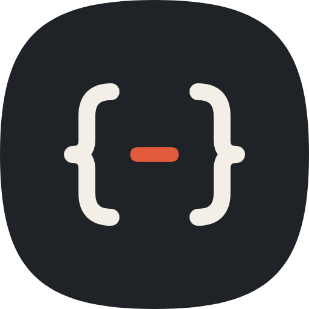
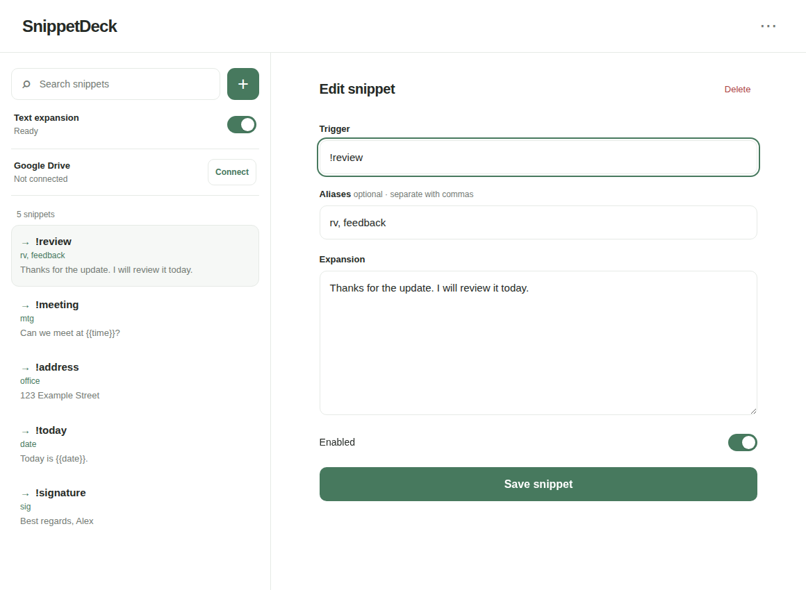
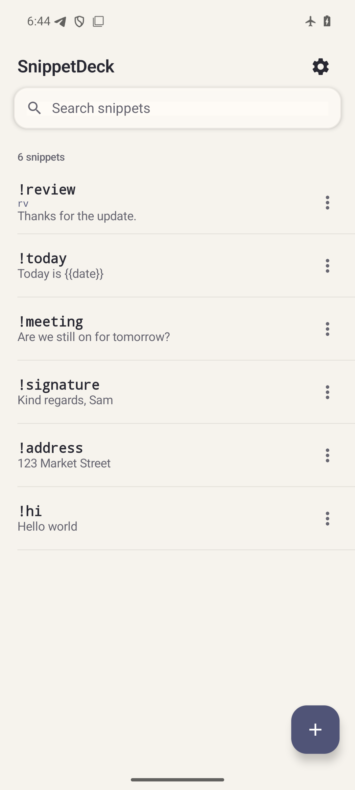
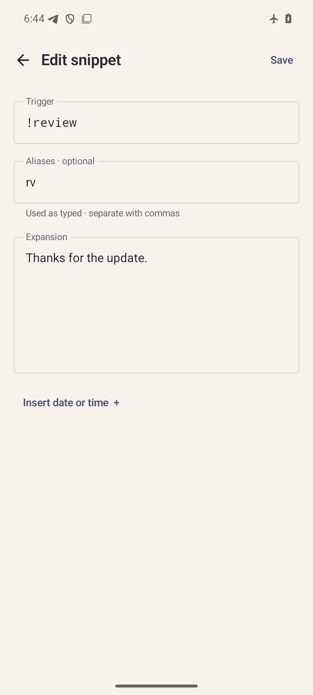

<h1 align="center">SnippetDeck</h1>

Превратите короткий триггер в текст, который часто вводите. SnippetDeck работает на Android, Windows, macOS и Linux; библиотека остаётся на устройстве, пока вы сами не включите синхронизацию.

  
  
  
  

<a href="https://github.com/Krablante/snippet-deck/releases/latest"><strong>Скачать</strong></a> · <a href="https://krablante.github.io/snippet-deck/ru/">Сайт</a> · <a href="../../LICENSE">Лицензия MIT</a>

 

Введите `!review` и нажмите пробел: SnippetDeck заменит триггер перед курсором сохранённым текстом. Всё после курсора останется на месте. Для сниппета можно задать псевдонимы и подстановки даты или времени. Немедленное нажатие Backspace вернёт триггер, если поле поддерживает это действие.

## Как выглядит

На компьютере библиотека и открытый сниппет находятся рядом. На снимке показаны демонстрационные записи.

На Android та же библиотека помещается на экране телефона.

 &nbsp; 

## Начало работы

Выберите файл для своей платформы в [последнем стабильном релизе](https://github.com/Krablante/snippet-deck/releases/latest):

| Платформа | Установщик | Подстановка текста |
| --- | --- | --- |
| Android 13+ | Подписанный `.apk` | Служба специальных возможностей Android |
| Windows x64 | `.msi` | Фоновый агент в трее |
| macOS Apple Silicon / Intel | Соответствующий `.dmg` | Фоновый агент с разрешением специальных возможностей |
| Linux x64 | `.deb` | X11; редактор работает и в Wayland |

Установите приложение, создайте сниппет и введите его триггер с пробелом в поле ввода. Библиотека хранится локально. Перенести её можно резервной копией или подключить необязательную синхронизацию через свою папку Google Drive `appDataFolder`. У SnippetDeck нет собственного сервера, учётной записи, аналитики и фонового опроса. Сборки для macOS пока не подписаны; перед установкой прочтите [заметки по установке](GUIDE.md#установка).

## Документация

Английские тексты находятся на обычных путях проекта. Переводы повторяют те же имена файлов в `docs/<код-языка>/`; новый язык добавляется отдельным каталогом и ссылками навигации. Стикеры категории и языка на каждой странице помогают ориентироваться.

| Категория | English | Русский |
| --- | --- | --- |
|  Использование, установка, копии, синхронизация | [Guide](../GUIDE.md) | [Руководство](GUIDE.md) |
|  Сборка и вклад в проект | [Contributing](../../CONTRIBUTING.md) | [Разработка](CONTRIBUTING.md) |
|  Код, данные, границы | [Architecture](../ARCHITECTURE.md) | [Архитектура](ARCHITECTURE.md) |
|  Выпуск и сопровождение | [Operations](../OPERATIONS.md) | [Эксплуатация](OPERATIONS.md) |
|  Данные и разрешения | [Privacy](../../PRIVACY.md) | [Конфиденциальность](PRIVACY.md) |

В основе SnippetDeck — [Expander](https://github.com/rrajath/expander) Раджата Радхакришнана и других участников. Установленные Android-версии сохраняют совместимость идентификаторов и старых форматов данных.
